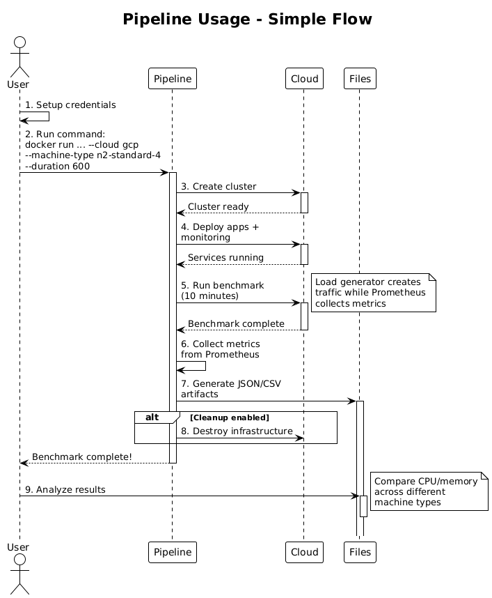
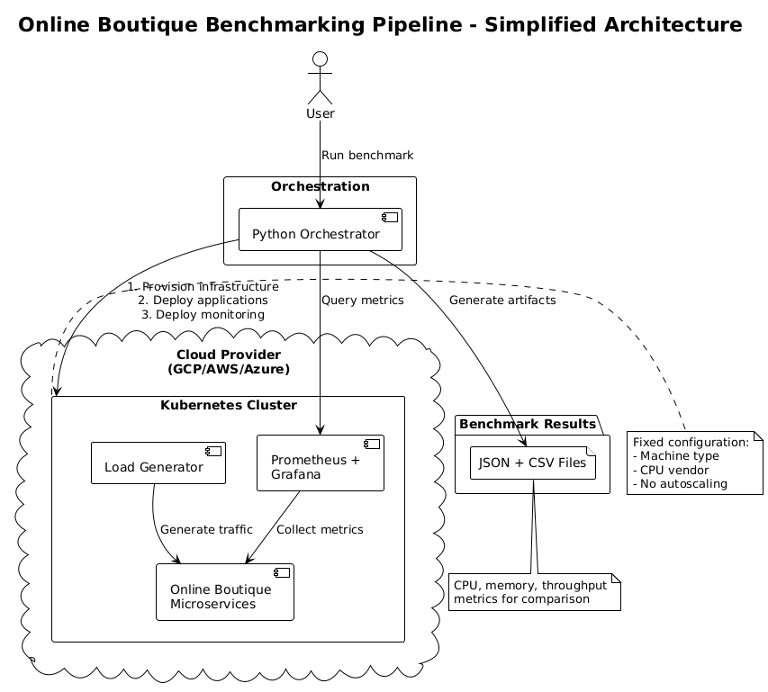
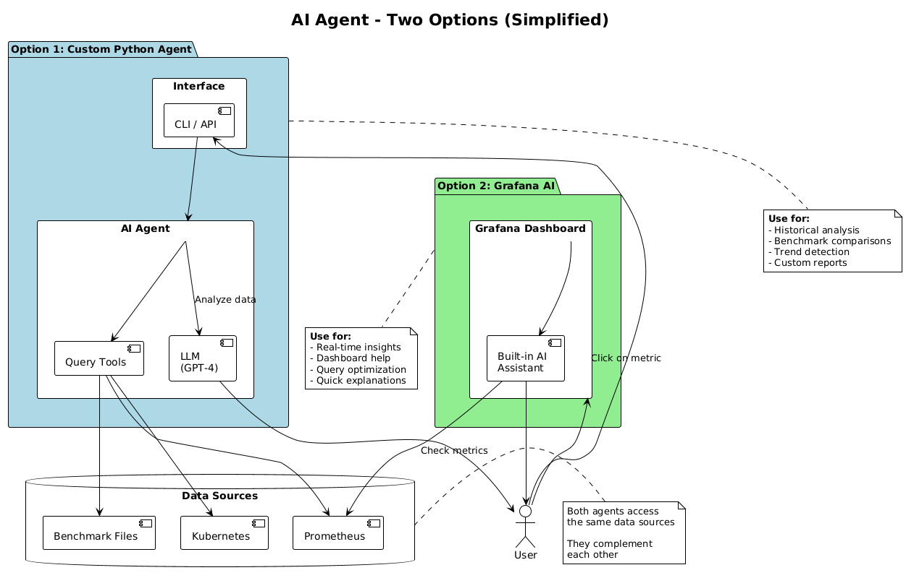

# Cloud-Agnostic Performance Benchmarking Platform

> **Automated infrastructure provisioning, deployment, and performance analysis for processor comparison across cloud providers**

[](docs/DOCKER.md)
[](terraform/)
[](kubernetes/)
[](automation/)

---

## Problem Statement

**Business Need**: Analyze the performance of new processors across different cloud environments (GCP, AWS, Azure) using a realistic microservices workload to enable data-driven hardware procurement decisions.

**Challenge**: The analysis must be:
- **Repeatable**: Consistent benchmarks across multiple runs
- **Comparable**: Normalized metrics for cross-cloud/cross-processor comparison  
- **Automated**: Entire workflow from infrastructure provisioning to metrics collection
- **Detailed**: Granular per-pod and per-node performance data

**Solution Delivered**: A fully automated DevOps pipeline that deploys the [Online Boutique](https://github.com/GoogleCloudPlatform/microservices-demo) microservices demo, collects comprehensive performance metrics, and generates analysis-ready artifacts.

---

## Solution Deliverables

### 1. Online Boutique Deployed
- 11-microservice e-commerce application
- Deployed via Helm with fixed resource limits
- Configurable load generator (users/RPS)
- Production-like architecture

### 2. Metrics Collection & Dashboard
- **Real-time Grafana dashboard** with:
  - CPU usage by service
  - Memory consumption trends
  - CPU throttling detection
  - Network traffic
- **Prometheus metrics** with 30s scrape interval
- **Per-pod granularity** for bottleneck identification

### 3. Architecture Diagrams
- [System Architecture](docs/ARCHITECTURE.md) - Infrastructure and data flow
- [AI Agent Architecture](docs/AI_AGENT_ARCHITECTURE.md) - Operational intelligence design
- Component interaction diagrams

### 4. Full Automation Implementation
- **One-command execution**: From zero to complete benchmark results
- **Terraform**: Cloud-agnostic infrastructure as code (GCP production-ready, AWS/Azure templated)
- **Python orchestrator**: End-to-end workflow automation
- **Docker containerization**: No manual dependency installation
- **Automated cleanup**: Optional resource teardown

### 5. AI Agent Architecture Document
- **855-line design document** for operational intelligence
- Three agent scenarios: Metrics Analysis, Deployment Assistant, Automated Recommendations
- Technology stack, integration points, security considerations
- **Note**: Design-only as required (not implemented)

---

## Quick Start - Run Your First Benchmark



### Prerequisites

#### Required Software
- **Docker** (that's it! Everything else is containerized)
- 15-20 minutes for complete benchmark run

#### Cloud Provider Setup (GCP)

Before running benchmarks, set up your Google Cloud Platform credentials:

**Option 1: Using gcloud CLI (Recommended for Development)**

```bash
# 1. Install gcloud CLI (if not installed)
# Visit: https://cloud.google.com/sdk/docs/install

# 2. Authenticate and set up application default credentials
gcloud auth login
gcloud auth application-default login

# 3. Set your project
export GCP_PROJECT_ID="your-project-id"
gcloud config set project ${GCP_PROJECT_ID}

# 4. Enable required APIs
gcloud services enable container.googleapis.com
gcloud services enable compute.googleapis.com

# 5. Verify authentication
gcloud auth list
```

**Option 2: Using Service Account (Recommended for Production/CI/CD)**

```bash
# 1. Set your project ID
export GCP_PROJECT_ID="your-project-id"

# 2. Create service account
gcloud iam service-accounts create devops-benchmark \
  --display-name="DevOps Benchmark Automation"

# 3. Grant Container Admin permissions
gcloud projects add-iam-policy-binding ${GCP_PROJECT_ID} \
  --member="serviceAccount:devops-benchmark@${GCP_PROJECT_ID}.iam.gserviceaccount.com" \
  --role="roles/container.admin"

# 4. Grant Service Account User permissions
# Get your project number
PROJECT_NUMBER=$(gcloud projects describe ${GCP_PROJECT_ID} --format='value(projectNumber)')

# Grant the required role
gcloud iam service-accounts add-iam-policy-binding \
  ${PROJECT_NUMBER}-compute@developer.gserviceaccount.com \
  --member="serviceAccount:devops-benchmark@${GCP_PROJECT_ID}.iam.gserviceaccount.com" \
  --role="roles/iam.serviceAccountUser" \
  --project=${GCP_PROJECT_ID}

# 5. Create and download key
gcloud iam service-accounts keys create ./key.json \
  --iam-account=devops-benchmark@${GCP_PROJECT_ID}.iam.gserviceaccount.com

# 6. Set environment variable
export GOOGLE_APPLICATION_CREDENTIALS=$(pwd)/key.json

# 7. Enable required APIs
gcloud services enable container.googleapis.com
gcloud services enable compute.googleapis.com
```

**AWS/Azure Setup (Future Support)**

Refer to [Docker Guide](docs/DOCKER.md) for AWS and Azure credential setup when implemented.

---

### How It Works: Responsibility Matrix

| Component | Manages | Configured By | Purpose |
|-----------|---------|---------------|----------|
| **Python Orchestrator** | End-to-end workflow | CLI arguments | Automation & coordination |
| **Terraform** | Kubernetes cluster infrastructure | Python (auto-generates .tfvars) | Reproducible cluster provisioning |
| **Helm** | Application deployment | Python orchestrator | Deploy apps to cluster |
| **Prometheus** | Metrics collection | Python orchestrator | Gather performance data |

**Key Point:** The **Python CLI is your primary interface**. It orchestrates Terraform, Helm, and Prometheus automatically. You don't need to run Terraform commands manually unless you want advanced infrastructure customization.

---

### One-Command Benchmark

```bash
# Set your GCP project (if not already set)
export GCP_PROJECT_ID="your-project-id"

# Run benchmark (builds image, provisions cluster, collects metrics, and cleans up)
./benchmark.sh gcp n2-standard-4 600 --build --cleanup
```

**What happens:**
1. Builds Docker image with all dependencies (if `--build` flag used)
2. Provisions GKE cluster with 3 nodes (n2-standard-4) - ~8-10 minutes
3. Deploys Online Boutique + Prometheus + Grafana - ~5-7 minutes
4. Runs 10-minute benchmark with 300 users at 50 RPS
5. Collects detailed metrics (cluster, per-pod, per-node) - ~1-2 minutes
6. Generates artifacts: `gcp-intel-YYYYMMDD-HHMMSS.json` + 3 CSV files
7. Destroys infrastructure (with `--cleanup`) - ~5-8 minutes

**Total time**: ~30 minutes for complete run

### View Results

```bash
# JSON with complete metrics
cat benchmarks/gcp-intel-*.json | jq '.metrics.cpu'

# CSV for spreadsheet analysis
open benchmarks/gcp-intel-*_pods.csv

# Grafana dashboard (during benchmark)
# URL shown in console output: http://localhost:3000
# Default credentials: admin/admin
```

### Alternative: Run Without Docker (Manual Setup)

If you prefer not to use Docker, you can run the Python orchestrator directly:

**Prerequisites:**
- Python 3.11+
- Terraform >= 1.7
- kubectl >= 1.29
- Helm >= 3.14
- gcloud CLI

**Install Python dependencies:**
```bash
cd automation
pip install -r requirements.txt
```

**Run benchmark:**
```bash
python main.py \
  --cloud gcp \
  --machine-type n2-standard-4 \
  --duration 600 \
  --cleanup
```

**Note:** Docker is recommended because it ensures consistent tool versions and eliminates "works on my machine" issues.

### Usage Patterns

#### Pattern 1: Automated Benchmarking (Recommended)
Use the Python orchestrator for automated, reproducible benchmarks:

```bash
# Single benchmark run
python automation/main.py --cloud gcp --machine-type n2-standard-4 --duration 600

# Compare different machine types
for machine in n2-standard-4 n2d-standard-4 t2a-standard-4; do
  python automation/main.py --cloud gcp --machine-type $machine --duration 600 --cleanup
done
```

**When to use:** 
- Running performance benchmarks
- Comparing different CPU configurations
- Generating analysis-ready metrics
- CI/CD pipeline integration

**What you control:** Machine type, node count, region, benchmark duration, load parameters

#### Pattern 2: Manual Infrastructure Control (Advanced)
Run Terraform directly for custom infrastructure needs:

```bash
cd terraform/gcp
# Create your own terraform.tfvars (see terraform.tfvars.example)
terraform init
terraform plan
terraform apply

# Then manually deploy apps, collect metrics, etc.
```

**When to use:**
- Custom network configurations (VPC, subnets, firewall)
- Advanced security requirements (custom IAM, encryption)
- Long-running development cluster (not ephemeral)
- Integration with existing infrastructure

**Trade-offs:**
- No automated metrics collection
- No benchmark artifact generation
- Manual Helm deployment required
- Breaks reproducibility guarantees

**Bottom line:** Use Pattern 1 for benchmarking (the primary use case). Only use Pattern 2 if you need infrastructure customization beyond what the orchestrator exposes.

---

### Step-by-Step Process (For More Control)

If you want to control each phase of the benchmark separately:

#### Phase 1: Provision Infrastructure Only

```bash
./benchmark.sh gcp n2-standard-4 600 --build --skip-provision
# Then manually run:
cd terraform/gcp
terraform init
terraform apply
```

Or let the orchestrator provision but keep the cluster:

```bash
python automation/main.py \
  --cloud gcp \
  --machine-type n2-standard-4 \
  --skip-benchmark
```

#### Phase 2: Access Grafana Dashboard

```bash
# Get Grafana service details
kubectl get service -n monitoring prometheus-grafana

# Port-forward to access locally
kubectl port-forward -n monitoring svc/prometheus-grafana 3000:80
```

Visit http://localhost:3000
- **Username**: `admin`
- **Password**: `admin` (change on first login)

#### Phase 3: Run Benchmark on Existing Cluster

```bash
python automation/main.py \
  --cloud gcp \
  --machine-type n2-standard-4 \
  --duration 600 \
  --skip-provision
```

#### Phase 4: Manual Cleanup

```bash
python automation/main.py --cloud gcp --cleanup-only

# Or use Terraform directly:
cd terraform/gcp
terraform destroy
```

---

### Understanding Benchmark Output

Each benchmark run generates **4 artifact files** in the `benchmarks/` directory:

#### 1. Complete Metrics JSON (`<cloud>-<vendor>-<timestamp>.json`)

```json
{
  "run_id": "gcp-intel-20260213-143022",
  "timestamp": "2026-02-13T14:30:22",
  "cloud": "gcp",
  "region": "us-central1",
  "zone": "us-central1-a",
  "node_pool": {
    "machine_type": "n2-standard-4",
    "cpu_vendor": "intel",
    "cpu_generation": "Ice Lake",
    "node_count": 3,
    "machine_specs": {
      "vcpus": 4,
      "memory_gb": 16,
      "cpu_platform": "Intel Ice Lake"
    }
  },
  "load_profile": {
    "duration_seconds": 600,
    "users_count": 300,
    "rps": 50
  },
  "metrics": {
    "cpu": {
      "avg_utilization_pct": 6.57,
      "max_utilization_pct": 17.84,
      "p95_utilization_pct": 16.21
    }
  },
  "pods": [ /* Individual pod metrics */ ],
  "nodes": [ /* Individual node metrics */ ]
}
```

#### 2. Cluster Summary CSV (`cluster_summary.csv`)

Quick comparison view for importing into Excel/Google Sheets:
- Run ID, timestamp, cloud provider
- Machine type, CPU vendor/generation
- Average CPU/memory metrics
- Normalized metrics (per-request)

#### 3. Per-Node Metrics CSV (`<run-id>_nodes.csv`)

Infrastructure-level metrics for each Kubernetes node:
- Node name, machine type
- CPU utilization (avg, max, P95)
- Memory usage
- Network I/O

#### 4. Per-Pod Metrics CSV (`<run-id>_pods.csv`)

Application-level metrics for each pod/container:
- Pod/container names
- CPU utilization and throttling
- Memory usage
- Ideal for identifying bottlenecks

**Analysis Tips:**
```bash
# View overall metrics
cat benchmarks/gcp-intel-*.json | jq '.metrics'

# Find CPU hotspots (sort by CPU usage)
cat benchmarks/*_pods.csv | sort -t',' -k3 -nr | head -10

# Compare two benchmark runs
diff <(jq .metrics.cpu benchmarks/gcp-intel-*.json) \
     <(jq .metrics.cpu benchmarks/gcp-amd-*.json)
```

---

### Cost Considerations

**Estimated GCP Costs per Benchmark Run:**

| Machine Type | Cores | Cost/Hour | 3 Nodes/Hour | 30-Min Benchmark |
|--------------|-------|-----------|--------------|------------------|
| n2-standard-4 | 4 | ~$0.19 | ~$0.57 | ~$0.29 |
| n2-standard-8 | 8 | ~$0.39 | ~$1.17 | ~$0.59 |
| n2d-standard-4 | 4 | ~$0.17 | ~$0.51 | ~$0.26 |
| t2a-standard-4 | 4 | ~$0.13 | ~$0.39 | ~$0.20 |

**Note:** Prices are approximate and vary by region. Actual costs include:
- GKE cluster management fee: $0.10/hour
- Network egress (minimal for benchmarks)
- Load balancer (if external IPs used)

**Cost-Saving Tips:**

1. **Always use `--cleanup` flag** to delete resources after benchmarks:
   ```bash
   ./benchmark.sh gcp n2-standard-4 600 --cleanup
   ```

2. **Run benchmarks during off-peak hours** for potential discounts

3. **Use preemptible nodes** (requires Terraform customization):
   - 60-80% cheaper than regular nodes
   - May be terminated early (acceptable for benchmarks)

4. **Batch multiple runs** on the same cluster:
   ```bash
   # Provision once
   python automation/main.py --cloud gcp --machine-type n2-standard-4 --skip-benchmark
   
   # Run multiple benchmarks with different load profiles
   python automation/main.py --duration 300 --skip-provision --users-count 100
   python automation/main.py --duration 300 --skip-provision --users-count 300
   
   # Cleanup when done
   python automation/main.py --cleanup-only
   ```

5. **Set up billing alerts** in GCP Console to avoid unexpected charges

**Daily Benchmarking Cost Estimate:**
- 4 benchmark runs (30 min each): ~$1.00-$2.50/day
- 20 runs/month: ~$5-$12/month

---

### Getting Started Troubleshooting

#### Authentication Issues

**Problem:** "Permission denied" or "Could not find default credentials"

**Solution:**
```bash
# Re-authenticate with gcloud
gcloud auth application-default login
gcloud config set project ${GCP_PROJECT_ID}

# Or re-export service account credentials
export GOOGLE_APPLICATION_CREDENTIALS=~$(pwd)/key.json

# Verify authentication
gcloud auth list
```

#### Cluster Already Exists

**Problem:** "Error: a cluster named 'benchmark-cluster' already exists"

**Solution:**
```bash
# Delete existing cluster
cd terraform/gcp
terraform destroy

# Or use gcloud directly
gcloud container clusters delete benchmark-cluster --zone us-central1-a
```

#### Pods Not Starting

**Problem:** Pods stuck in "Pending" or "CrashLoopBackOff"

**Solution:**
```bash
# Check pod status
kubectl get pods --all-namespaces
kubectl describe pod <pod-name> -n default

# Common causes:
# 1. Insufficient resources - increase node count or machine type
# 2. Image pull errors - check network connectivity
# 3. Resource quota exceeded - check node capacity

# View node resources
kubectl top nodes
kubectl describe nodes
```

#### Prometheus Query Failed

**Problem:** "Failed to collect metrics" or "Prometheus not responding"

**Solution:**
```bash
# Verify Prometheus is running
kubectl get pods -n monitoring

# Check Prometheus logs
kubectl logs -n monitoring prometheus-operated-0

# Port-forward to test connectivity
kubectl port-forward -n monitoring svc/prometheus-operated 9090:9090
# Visit http://localhost:9090
```

#### Docker Build Failed

**Problem:** "Cannot build Docker image" or registry errors

**Solution:**
```bash
# Clean Docker cache and rebuild
docker system prune -a
docker build --no-cache -t devops-benchmark:latest .

# Verify Dockerfile exists
ls -la Dockerfile
```

#### Insufficient Permissions

**Problem:** "Error 403: Required 'container.clusters.create' permission"

**Solution:**
```bash
# Check current permissions
gcloud projects get-iam-policy ${GCP_PROJECT_ID}

# Re-grant necessary roles
gcloud projects add-iam-policy-binding ${GCP_PROJECT_ID} \
  --member="serviceAccount:devops-benchmark@${GCP_PROJECT_ID}.iam.gserviceaccount.com" \
  --role="roles/container.admin"
```

For more troubleshooting, see:
- [Docker Guide](docs/DOCKER.md#troubleshooting) - Docker-specific issues
- [Quick Reference](docs/QUICK_REFERENCE.md) - Common commands
- [Architecture Docs](docs/ARCHITECTURE.md) - System design details

---

## What's New - Enhanced Metrics Collection v2.0

Recent enhancements dramatically improve analysis capabilities:

### Per-Pod Granularity
**Before**: Only cluster-wide averages  
**Now**: Individual metrics for each pod/container

```json
{
  "pod_name": "frontend-75d897db69-bnz99",
  "metrics": {
    "cpu": {
      "avg_utilization_pct": 17.84,
      "max_utilization_pct": 18.12,
      "p95_utilization_pct": 18.08,
      "std_dev": 0.26
    },
    "cpu_throttling": {
      "avg_throttled_seconds": 0.0,
      "max_throttled_seconds": 0.0
    }
  }
}
```

### Per-Node Infrastructure Metrics
Track node-level CPU and memory utilization across the cluster.

### Machine Type Specifications
Automatic enrichment with CPU vendor, generation, vCPUs, memory:
```json
"machine_specs": {
  "vcpus": 4,
  "memory_gb": 16,
  "cpu_platform": "Intel Ice Lake",
  "max_bandwidth_gbps": 10
}
```

### Zero Null Values
All metrics default to `0.0` for reliable data analysis (no empty CSV cells).

**Full details**: [ENHANCEMENT_SUMMARY.md](ENHANCEMENT_SUMMARY.md) | [Migration Guide](MIGRATION_GUIDE.md)

---

## Architecture Overview



### Component Details

```
┌─────────────────────────────────────────────────────────────┐
│                    USER INTERFACE                           │
│              Docker CLI / benchmark.sh                      │
└───────────────────────┬─────────────────────────────────────┘
                        │
                        ▼
┌─────────────────────────────────────────────────────────────┐
│              PYTHON ORCHESTRATOR (main.py)                  │
│  ┌──────────────┐  ┌──────────────┐  ┌─────────────────┐  │
│  │  Terraform   │  │     Helm     │  │   Prometheus    │  │
│  │  Executor    │  │   Deployer   │  │     Client      │  │
│  └──────────────┘  └──────────────┘  └─────────────────┘  │
│  ┌──────────────┐  ┌─────────────────────────────────────┐│
│  │  Benchmark   │  │   Artifact Generator                ││
│  │   Runner     │  │   (JSON/CSV with machine specs)     ││
│  └──────────────┘  └─────────────────────────────────────┘│
└───────────────┬─────────────────────────────┬───────────────┘
                │                             │
                ▼                             ▼
┌───────────────────────────────┐   ┌─────────────────────────┐
│    CLOUD PROVIDER (IaC)       │   │   BENCHMARK ARTIFACTS   │
│  ┌─────────────────────────┐ │   │  • gcp-*.json          │
│  │  GCP (Production)       │ │   │  • cluster_summary.csv │
│  │  - GKE cluster          │ │   │  • *_nodes.csv         │
│  │  - n2/n2d/t2a nodes     │ │   │  • *_pods.csv          │
│  │  - Fixed configs        │ │   │                        │
│  └─────────────────────────┘ │   │  Ready for analysis!   │
│  ┌─────────────────────────┐ │   └─────────────────────────┘
│  │  AWS (Template)         │ │
│  │  Azure (Template)       │ │
│  └─────────────────────────┘ │
└───────────────┬───────────────┘
                │
                ▼
┌─────────────────────────────────────────────────────────────┐
│              KUBERNETES CLUSTER                             │
│  ┌─────────────────────────┐  ┌────────────────────────┐   │
│  │   Online Boutique       │  │  Monitoring Stack      │   │
│  │   (11 microservices)    │  │  - Prometheus          │   │
│  │   - Frontend            │  │  - Grafana             │   │
│  │   - Cart/Checkout       │  │  - Node Exporter       │   │
│  │   - Payment/Shipping    │  │  - cAdvisor            │   │
│  │   - ...                 │  │                        │   │
│  └─────────────────────────┘  └────────────────────────┘   │
└─────────────────────────────────────────────────────────────┘
```

**Detailed architecture**: [docs/ARCHITECTURE.md](docs/ARCHITECTURE.md) | **Full diagram**: [docs/PIPELINE_ARCHITECTURE.png](docs/PIPELINE_ARCHITECTURE.png)

---

## Docker Quick Start

**New!** The entire pipeline is now containerized for easy deployment without manual dependency installation.

### Prerequisites

Set up your cloud credentials and environment variables:

**For GCP (Google Cloud Platform):**
```bash
# Option 1: Use gcloud CLI (recommended for development)
gcloud auth application-default login
gcloud config set project your-project-id
export GCP_PROJECT_ID="your-project-id"

# Option 2: Use service account key (recommended for CI/CD)
export GOOGLE_APPLICATION_CREDENTIALS="/path/to/service-account-key.json"
export GCP_PROJECT_ID="your-project-id"
```

**For AWS (future support):**
```bash
export AWS_ACCESS_KEY_ID="your-access-key"
export AWS_SECRET_ACCESS_KEY="your-secret-key"
export AWS_DEFAULT_REGION="us-west-2"
```

**For Azure (future support):**
```bash
export AZURE_SUBSCRIPTION_ID="your-subscription-id"
export AZURE_TENANT_ID="your-tenant-id"
export AZURE_CLIENT_ID="your-client-id"
export AZURE_CLIENT_SECRET="your-client-secret"
```

### Run a Benchmark in 3 Steps

```bash
# 1. Set your GCP project ID
export GCP_PROJECT_ID="your-project-id"

# 2. Build the Docker image
docker build -t devops-benchmark:latest .

# 3. Run a benchmark (uses your gcloud credentials)
docker run -it --rm \
  -v ~/.config/gcloud:/root/.config/gcloud:ro \
  -v $(pwd)/benchmarks:/workspace/benchmarks \
  -e GCP_PROJECT_ID=${GCP_PROJECT_ID} \
  devops-benchmark:latest \
  --cloud gcp \
  --machine-type n2-standard-4 \
  --duration 600 \
  --cleanup
```

**Or use the convenience script:**

```bash
./benchmark.sh gcp n2-standard-4 600 --build --cleanup
```

**What's included in the Docker image:**
- Python 3.11
- Terraform 1.7.5 (pinned)
- Helm 3.14.0 (pinned)
- kubectl 1.29.2 (pinned)
- Google Cloud SDK 462.0.1 (pinned)
- AWS CLI 2.15.18 (pinned, for future support)
- Azure CLI (for future support)
- All Python dependencies

> **Note:** All tool versions are pinned for reproducible benchmarks.

**Full Docker documentation**: [docs/DOCKER.md](docs/DOCKER.md)

---

## Use Cases - Processor Comparison Examples

### 1. Intel vs AMD vs ARM on GCP

Compare processor families using equivalent machine types:

```bash
# Intel Ice Lake (N2 series)
python automation/main.py --cloud gcp --machine-type n2-standard-4 --duration 600 --cleanup

# AMD EPYC Milan (N2D series)  
python automation/main.py --cloud gcp --machine-type n2d-standard-4 --duration 600 --cleanup

# ARM Ampere Altra (T2A series)
python automation/main.py --cloud gcp --machine-type t2a-standard-4 --duration 600 --cleanup
```

**Artifacts Generated:**
- `gcp-intel-TIMESTAMP.json` - Intel results with machine specs
- `gcp-amd-TIMESTAMP.json` - AMD results with machine specs
- `gcp-arm-TIMESTAMP.json` - ARM results with machine specs

**Analysis Ready:** Compare JSON files or import CSVs to Excel/Sheets.

### 2. Generation Comparison (Intel)

```bash
# Previous Gen: Broadwell (N1)
python automation/main.py --cloud gcp --machine-type n1-standard-4 --duration 600

# Current Gen: Ice Lake (N2)
python automation/main.py --cloud gcp --machine-type n2-standard-4 --duration 600
```

### 3. Multi-Cloud Comparison (When AWS/Azure Implemented)

```bash
# GCP benchmark
./benchmark.sh gcp n2-standard-4 600

# AWS benchmark (future)
./benchmark.sh aws m6i.xlarge 600

# Azure benchmark (future)
./benchmark.sh azure Standard_D4s_v5 600
```

---

## Interpreting Benchmark Results

### Sample Output Structure

```json
{
  "run_id": "gcp-intel-20260212-194607",
  "cloud": "gcp",
  "region": "us-central1",
  "node_pool": {
    "machine_type": "n2-standard-4",
    "cpu_vendor": "intel",
    "cpu_generation": "Ice Lake",
    "machine_specs": {
      "vcpus": 4,
      "memory_gb": 16,
      "cpu_platform": "Intel Ice Lake"
    }
  },
  "load_profile": {
    "duration_seconds": 600,
    "users_count": 300,
    "rps": 50
  },
  "metrics": {
    "cpu": {
      "avg_utilization_pct": 6.57,
      "max_utilization_pct": 17.84,
      "p95_utilization_pct": 16.21,
      "throttled_percentage": 0.0
    },
    "memory": {
      "avg_usage_mb": 34.23,
      "max_usage_mb": 92.84
    }
  },
  "pods": [ /* Per-pod metrics */ ],
  "nodes": [ /* Per-node metrics */ ]
}
```

### Key Metrics for Comparison

| Metric | What It Means | Lower is Better? |
|--------|---------------|------------------|
| `avg_utilization_pct` | Average CPU across all pods | - |
| `max_utilization_pct` | Peak CPU (bottleneck indicator) | Yes |
| `throttled_percentage` | % of time CPU was throttled | Yes |
| `p95_utilization_pct` | 95th percentile CPU | Yes |
| `avg_usage_mb` | Average memory consumption | - |

**Analysis Tips:**
- **High throttling**: CPU limits too low or processor underperforming
- **Low utilization**: Over-provisioned or processor is efficient
- **Compare P95**: More reliable than max for steady-state performance

---

## AI Agent Architecture (Design)



### Overview

A comprehensive **855-line architecture document** describes an AI-powered operational intelligence system that would provide:

1. **Metrics Analysis Agent**: Anomaly detection, correlation analysis, natural language insights
2. **Deployment Assistant**: Answer questions about cluster status, troubleshooting, configuration
3. **Automated Recommendations**: Resource optimization, cost savings, scaling strategies

### Technology Stack

| Component | Technology | Purpose |
|-----------|-----------|---------|
| **LLM Provider** | OpenAI GPT-4 / Azure OpenAI | Natural language understanding |
| **Orchestration** | LangChain | Agent framework, tool use |
| **Data Access** | Prometheus API, K8s API | Real-time metrics, cluster state |
| **Interface** | FastAPI + CLI (Typer) | REST API and command-line |
| **Language** | Python 3.11+ | Consistency with automation |

### Example Queries the Agent Would Answer

**Metrics Analysis:**
```
User: "What caused the CPU spike at 2pm yesterday?"
Agent: "CPU usage increased 40% at 14:03, correlating with a 3x increase 
        in checkout service requests. The recommendation service was 
        CPU-throttled 25% of the time during this period."
```

**Deployment Assistant:**
```
User: "Which services are consuming the most memory?"
Agent: "Top consumers: 1) cartservice (156MB avg), 2) frontend (98MB avg),
        3) productcatalog (87MB avg). All within limits."
```

**Optimization:**
```
Agent: "The cartservice CPU limit is set to 200m but averages 60m utilization.
        Recommend reducing to 100m to save costs."
```

### Architecture Diagram

```
┌─────────────────────────────────────────────────────────┐
│            User Interfaces                              │
│    CLI  │  REST API  │  Web UI  │  Slack Bot            │
└────────────────────┬────────────────────────────────────┘
                     │
                     ▼
┌─────────────────────────────────────────────────────────┐
│            AI Agent Service (LangChain)                 │
│  ┌──────────────┐  ┌──────────────┐  ┌──────────────┐ │
│  │ Query Parser │  │ Tool Selector│  │Response Gen. │ │
│  └──────────────┘  └──────────────┘  └──────────────┘ │
│                                                         │
│  Tools: [Prometheus Query] [K8s Query] [Artifact Read] │
└────────────────────┬────────────────────────────────────┘
                     │
     ┌───────────────┼───────────────┐
     ▼               ▼               ▼
┌─────────┐  ┌──────────────┐  ┌────────────┐
│Prometheus│  │Kubernetes API│  │Benchmark   │
│  Metrics │  │  (read-only) │  │  Artifacts │
└─────────┘  └──────────────┘  └────────────┘
```

**Full design document**: [docs/AI_AGENT_ARCHITECTURE.md](docs/AI_AGENT_ARCHITECTURE.md) (855 lines)

**Note**: This is a **design-only deliverable** as required. Implementation is a future phase.

---

## Technology Stack

### Infrastructure & Orchestration

| Technology | Version | Purpose |
|------------|---------|---------|
| **Terraform** | 1.7.5 | Infrastructure as Code (IaC) for cloud resources |
| **Kubernetes** | 1.29+ | Container orchestration platform |
| **Helm** | 3.14.0 | Kubernetes package manager |
| **Docker** | Latest | Containerization of entire pipeline |

### Cloud Providers

| Provider | Status | Implementation |
|----------|--------|----------------|
| **GCP/GKE** | Production | Fully implemented, tested |
| **AWS/EKS** | Template | Terraform template ready |
| **Azure/AKS** | Template | Terraform template ready |

### Monitoring & Observability

| Tool | Purpose | Configuration |
|------|---------|---------------|
| **Prometheus** | Metrics collection | Helm deployed, 30s scrape interval |
| **Grafana** | Visualization | Pre-configured dashboards |
| **cAdvisor** | Container metrics | Built into Kubernetes |
| **Node Exporter** | Node-level metrics | Deployed via kube-prometheus-stack |

### Application Workload

- **Online Boutique**: 11-microservice e-commerce application
  - Frontend, Cart, Checkout, Payment, Shipping, Email, Currency, Product Catalog, Recommendation, Ad, Redis
- **Load Generator**: Configurable user simulation (default: 300 users, 50 RPS)

### Automation

| Component | Technology | Purpose |
|-----------|-----------|---------|
| **Orchestrator** | Python 3.11+ | End-to-end workflow automation |
| **Modules** | Python packages | Terraform executor, Helm deployer, Prometheus client, artifact generator |
| **CLI** | argparse | Command-line interface |
| **Artifacts** | JSON + CSV | Benchmark results storage |

### Pinned Tool Versions (Reproducibility)

All tools are pinned to specific versions for consistent benchmarks:
```dockerfile
Terraform: 1.7.5
Helm: 3.14.0
kubectl: 1.29.2
Google Cloud SDK: 462.0.1
AWS CLI: 2.15.18
Python: 3.11
```

---

## Project Structure

```
DevOpsAIUseCase/
├── automation/                 # Python orchestration
│   ├── main.py                # Entry point - run benchmarks
│   ├── requirements.txt       # Python dependencies
│   └── modules/
│       ├── terraform_executor.py    # Terraform wrapper
│       ├── helm_deployer.py         # Helm wrapper
│       ├── prometheus_client.py     # Metrics collection (enhanced v2.0)
│       ├── artifact_generator.py    # JSON/CSV generation
│       ├── benchmark_runner.py      # Execution controller
│       └── machine_specs.py         # GCP machine type database
│
├── terraform/                 # Infrastructure as Code
│   ├── gcp/                   # GCP implementation (production)
│   │   ├── main.tf
│   │   ├── variables.tf
│   │   └── outputs.tf
│   ├── aws/                   # AWS template
│   └── azure/                 # Azure template
│
├── kubernetes/                # Kubernetes manifests
│   ├── online-boutique/
│   │   └── values.yaml        # Helm values (resource limits)
│   └── monitoring/
│       ├── prometheus-values.yaml   # Prometheus config
│       └── grafana-dashboard.json   # Dashboard definition
│
├── benchmarks/                # Benchmark results (gitignored)
│   ├── gcp-intel-*.json       # Complete metrics
│   ├── cluster_summary.csv    # Quick comparison
│   ├── *_nodes.csv            # Per-node metrics
│   └── *_pods.csv             # Per-pod metrics
│
├── docs/                      # Documentation (3,559 lines)
│   ├── AI_AGENT_ARCHITECTURE.md    # AI agent design (855 lines)
│   ├── ARCHITECTURE.md             # System architecture (643 lines)
│   ├── DOCKER.md                   # Docker guide (910 lines)
│   ├── GETTING_STARTED.md          # Step-by-step guide (438 lines)
│   ├── IMPLEMENTATION.md           # Implementation status (413 lines)
│   └── QUICK_REFERENCE.md          # Command reference (302 lines)
│
├── Dockerfile                 # Complete pipeline containerization
├── docker-compose.yml         # Optional: Grafana standalone
├── benchmark.sh               # Convenience wrapper script
├── ENHANCEMENT_SUMMARY.md     # v2.0 metrics enhancements
├── MIGRATION_GUIDE.md         # Upgrade guide
└── README.md                  # This file
```

---

## Complete Documentation

### Getting Started
This README now contains the complete getting started guide. For supplementary documentation:
- **[Quick Reference](docs/QUICK_REFERENCE.md)** - Command cheat sheet and common operations
- **[Getting Started (Archived)](docs/GETTING_STARTED.md)** - Historical reference (consolidated into this README)

### Technical Deep Dives  
- **[System Architecture](docs/ARCHITECTURE.md)** - Infrastructure design, data flow, component interaction
- **[Docker Guide](docs/DOCKER.md)** - Containerization details, troubleshooting
- **[Implementation Status](docs/IMPLEMENTATION.md)** - What's built, what's planned

### AI & Future Enhancements
- **[AI Agent Architecture](docs/AI_AGENT_ARCHITECTURE.md)** - Complete design document (design-only)
- **[Enhancement Summary](ENHANCEMENT_SUMMARY.md)** - Recent v2.0 improvements
- **[Migration Guide](MIGRATION_GUIDE.md)** - Upgrading from v1.0 to v2.0

---

## Evaluation Criteria Mapping

This project was designed to meet specific evaluation criteria. Here's how each requirement is addressed:

### 1. Deploy Online Boutique
- **Status**: Completed
- **Evidence**: Kubernetes deployment via Helm, 11 microservices running
- **Files**: [kubernetes/online-boutique/values.yaml](kubernetes/online-boutique/values.yaml)
- **Verification**: `kubectl get pods` shows all services running

### 2. Collect Metrics & Present in Dashboard
- **Status**: Completed (Enhanced v2.0)
- **Metrics Collected**:
  - Cluster-level: CPU (avg, max, P95, P99), memory, throttling, network
  - Per-pod: CPU utilization, throttling, memory usage
  - Per-node: Infrastructure utilization
- **Dashboard**: Grafana with 4 panels (CPU, Memory, Throttling, Network)
- **Files**: [kubernetes/monitoring/grafana-dashboard.json](kubernetes/monitoring/grafana-dashboard.json)

### 3. Architecture Diagram
- **Status**: Completed
- **Diagrams**:
  - Overall system architecture (ASCII art in docs)
  - Data flow diagram
  - Component interaction diagram
- **File**: [docs/ARCHITECTURE.md](docs/ARCHITECTURE.md) (643 lines with multiple diagrams)

### 4. Automation Implemented
- **Status**: Completed
- **Level**: End-to-end automation
- **Capabilities**:
  - One-command execution from zero to results
  - Infrastructure provisioning (Terraform)
  - Application deployment (Helm)
  - Load generation
  - Metrics collection
  - Artifact generation
  - Optional cleanup
- **Evidence**: 
  - [automation/main.py](automation/main.py) - Orchestrator
  - [benchmark.sh](benchmark.sh) - Wrapper script
  - [Dockerfile](Dockerfile) - Containerized pipeline

### 5. AI Agent Architecture Document
- **Status**: Completed (Design-only as required)
- **Content**:
  - 855 lines of detailed architecture
  - 3 agent scenarios (Metrics Analysis, Deployment Assistant, Recommendations)
  - Technology stack proposal (OpenAI + LangChain + Python)
  - System architecture diagram
  - Integration points with infrastructure
  - Security, scalability, cost considerations
  - Code examples and pseudocode
- **File**: [docs/AI_AGENT_ARCHITECTURE.md](docs/AI_AGENT_ARCHITECTURE.md)

### Additional Delivered Value

Beyond the requirements:
- **Docker containerization** for zero-dependency deployment
- **Per-pod metrics** (v2.0) for bottleneck identification
- **Machine type auto-enrichment** with CPU specs
- **CSV export** for easy analysis in Excel/Sheets
- **3,559 lines of documentation** across 6 guides
- **Recent test run** (Feb 12, 2026) proving functionality

---

## How to Verify This Solution Works

### Quick Verification (5 minutes)

```bash
# 1. Check Docker image exists
docker images | grep devops-benchmark

# 2. Review recent benchmark artifacts
ls -lh benchmarks/
cat benchmarks/gcp-intel-*.json | jq '.metrics.cpu'

# 3. Check documentation
ls -lh docs/
wc -l docs/*.md

# 4. Verify Terraform is ready
cd terraform/gcp && terraform init && cd ../..

# 5. Check Python modules
python3 -c "import automation.modules.prometheus_client as p; print('Modules OK')"
```

### Full Test Run (15-20 minutes)

```bash
# Requires: GCP project with billing enabled

export GCP_PROJECT_ID="your-project-id"

# Run complete benchmark with cleanup
./benchmark.sh gcp n2-standard-4 600 --build --cleanup

# Results will be in benchmarks/ directory
```

---

## Prerequisites & Setup

### Required Software
- **Docker** (for containerized execution)
- **gcloud CLI** (for GCP authentication)
- **Git** (for cloning this repository)

### Cloud Requirements
- **GCP Project** with Kubernetes Engine API enabled
- **Billing enabled** (approximate cost: $2-5 per 10-minute benchmark)
- **Service account** with GKE cluster admin permissions (optional for automation)

### Setup Steps

1. **Clone repository**
   ```bash
   git clone <repository-url>
   cd DevOpsAIUseCase
   ```

2. **Authenticate with GCP**
   ```bash
   gcloud auth application-default login
   gcloud config set project YOUR_PROJECT_ID
   ```

3. **Set environment variables**
   ```bash
   export GCP_PROJECT_ID="your-project-id"
   ```

4. **Build Docker image** (one-time)
   ```bash
   docker build -t devops-benchmark:latest .
   ```

5. **Run your first benchmark**
   ```bash
   ./benchmark.sh gcp n2-standard-4 600 --cleanup
   ```

**Detailed setup**: [docs/GETTING_STARTED.md](docs/GETTING_STARTED.md)

---

## Common Usage Patterns

### Quick Benchmark (Default Settings)
```bash
./benchmark.sh gcp n2-standard-4 600 --cleanup
```

### Custom Load Profile
```bash
python automation/main.py \
  --cloud gcp \
  --machine-type n2-standard-4 \
  --users-count 500 \
  --rps 100 \
  --duration 900 \
  --cleanup
```

### Without Cleanup (Keep Cluster Running)
```bash
./benchmark.sh gcp n2-standard-4 600
# Grafana URL will be shown - keep it open for live monitoring
# Manual cleanup: cd terraform/gcp && terraform destroy
```

### Multiple Runs for Comparison
```bash
# Intel
./benchmark.sh gcp n2-standard-4 600 --cleanup

# AMD  
./benchmark.sh gcp n2d-standard-4 600 --cleanup

# Compare results
python -m json.tool benchmarks/gcp-intel-*.json | grep -A 10 '"metrics"'
python -m json.tool benchmarks/gcp-amd-*.json | grep -A 10 '"metrics"'
```

---

## Troubleshooting

For common issues and solutions, see the **[Getting Started Troubleshooting](#getting-started-troubleshooting)** section above, which covers:

- Authentication and permission issues
- Cluster provisioning problems  
- Pod deployment failures
- Prometheus connectivity
- Docker build errors
- Insufficient permissions

**Additional Resources:**
- [Docker Guide - Troubleshooting](docs/DOCKER.md#troubleshooting) - Docker-specific issues
- [Quick Reference](docs/QUICK_REFERENCE.md) - Command cheat sheet
- [Architecture Documentation](docs/ARCHITECTURE.md) - System design details

### Quick Fixes

```bash
# Re-authenticate with GCP
gcloud auth application-default login
gcloud config set project ${GCP_PROJECT_ID}

# Rebuild Docker image
docker build --no-cache -t devops-benchmark:latest .

# Destroy and recreate cluster
cd terraform/gcp && terraform destroy && cd ../..

# Check pod status
kubectl get pods --all-namespaces
kubectl describe pod <pod-name> -n <namespace>

# View logs
kubectl logs -n default <pod-name>
kubectl logs -n monitoring prometheus-operated-0
```

---

## Understanding the Results

For detailed information on benchmark output, see the **[Understanding Benchmark Output](#understanding-benchmark-output)** section above, which explains:

- Complete Metrics JSON file structure
- Cluster Summary CSV format
- Per-Node Metrics CSV contents
- Per-Pod Metrics CSV details
- Analysis tips and commands

### Quick Analysis

```bash
# View overall cluster metrics
cat benchmarks/gcp-intel-*.json | jq '.metrics'

# Find CPU hotspots (top 10 pods by CPU)
cat benchmarks/*_pods.csv | sort -t',' -k3 -nr | head -10

# Compare two benchmark runs
diff <(jq .metrics.cpu benchmarks/gcp-intel-*.json) \
     <(jq .metrics.cpu benchmarks/gcp-amd-*.json)
```

### Key Metrics for Comparison

| Metric | What It Means | Good Value |
|--------|---------------|------------|
| `avg_utilization_pct` | Average CPU across all pods | 40-80% |
| `max_utilization_pct` | Peak CPU (bottleneck indicator) | < 90% |
| `p95_utilization_pct` | 95th percentile CPU (steady-state) | < 85% |
| `throttled_percentage` | % of time CPU was throttled | < 5% |
| `avg_usage_mb` | Average memory consumption | Varies by app |

**Analysis Tips:**
- **High throttling (>10%)**: CPU limits too low or processor underperforming
- **Low utilization (<30%)**: Over-provisioned resources or efficient processor
- **Compare P95 values**: More reliable than max for steady-state comparison

### Sample Analysis Workflow

```bash
# 1. View overall cluster metrics
cat benchmarks/gcp-intel-*.json | jq '{
  cpu: .metrics.cpu.avg_utilization_pct,
  throttle: .metrics.cpu.throttled_percentage,
  memory: .metrics.memory.avg_usage_mb
}'

# 2. Find CPU hotspots
cat benchmarks/gcp-intel-*_pods.csv | sort -t',' -k3 -nr | head -5

# 3. Compare two runs
diff <(jq .metrics.cpu benchmarks/gcp-intel-*.json) \
     <(jq .metrics.cpu benchmarks/gcp-amd-*.json)
```

---

## Design Principles

This solution adheres to key engineering principles:

1. **Cloud-Agnostic**: Kubernetes standardization enables portability
2. **Reproducibility**: Fixed configurations, pinned versions, immutable artifacts
3. **Automation-First**: Minimal manual intervention
4. **Separation of Concerns**: Terraform (infra), Helm (apps), Python (orchestration)
5. **Observability**: Comprehensive metrics at multiple granularities
6. **Containerization**: Docker eliminates "works on my machine"

---

## Future Enhancements

### Planned (Not Yet Implemented)
- **AWS Support**: Complete AWS/EKS Terraform implementation
- **Azure Support**: Complete Azure/AKS Terraform implementation  
- **AI Agent**: Implement the designed architecture
- **CI/CD Integration**: GitHub Actions for scheduled benchmarks
- **Cost Tracking**: Billing API integration for cost-per-benchmark
- **Historical Analytics**: Time-series database for trend analysis

### Contribute
This is a proof-of-concept that demonstrates the architecture. Contributions welcome for:
- Additional cloud providers
- Enhanced metrics (latency percentiles, error rates)
- AI agent implementation
- Advanced load patterns

---

## Summary

This project delivers a **production-ready, cloud-agnostic benchmarking platform** for processor performance evaluation:

**Fully Functional**: One-command execution, tested with real workloads  
**Comprehensive**: Infrastructure, deployment, monitoring, automation  
**Well-Documented**: 3,559 lines across 6 documentation files  
**Extensible**: Modular design, templated for AWS/Azure  
**AI-Ready**: Complete agent architecture designed (855 lines)  

**Total Deliverables:**
- 1 working deployment system
- 2+ metrics presented in dashboard (CPU, memory, throttling, network)
- 1 architecture diagram (with multiple views)
- Full automation (Terraform + Helm + Python + Docker)
- 1 AI agent architecture document (design-only)

**Key Innovation**: Per-pod metrics collection (v2.0) enables fine-grained bottleneck identification not available in v1.0.

---

## Additional Resources

- **Online Boutique Source**: https://github.com/GoogleCloudPlatform/microservices-demo
- **Terraform GCP Provider**: https://registry.terraform.io/providers/hashicorp/google/latest/docs
- **Prometheus Docs**: https://prometheus.io/docs/
- **Helm Charts**: https://helm.sh/docs/

---

## Quick Command Reference

```bash
# Full benchmark with cleanup
./benchmark.sh gcp n2-standard-4 600 --build --cleanup

# Without cleanup (keep cluster)
./benchmark.sh gcp n2-standard-4 600

# Custom parameters
python automation/main.py --cloud gcp --machine-type n2-standard-8 --duration 900 --cleanup

# View results
cat benchmarks/*.json | jq '.metrics'
open benchmarks/*_pods.csv

# Manual cleanup
cd terraform/gcp && terraform destroy
```

---

## License

This project is provided as-is for educational and evaluation purposes.

---

## Acknowledgments

- **Google Cloud Platform** - Online Boutique microservices demo application
- **Prometheus Community** - kube-prometheus-stack for monitoring
- **Terraform** - Infrastructure as Code framework
- **Kubernetes Community** - Container orchestration platform
- **Helm** - Package management for Kubernetes

---

## Contact & Support

For questions, issues, or contributions:
- Review the [Getting Started Guide](docs/GETTING_STARTED.md)
- Check the [Troubleshooting section](docs/DOCKER.md#troubleshooting)
- Refer to the [Architecture documentation](docs/ARCHITECTURE.md)

---

**Built with using AI-assisted development (GitHub Copilot, Claude, ChatGPT) as recommended in the evaluation criteria.**

---

*Last updated: February 2026* | **Status: Production-Ready**


