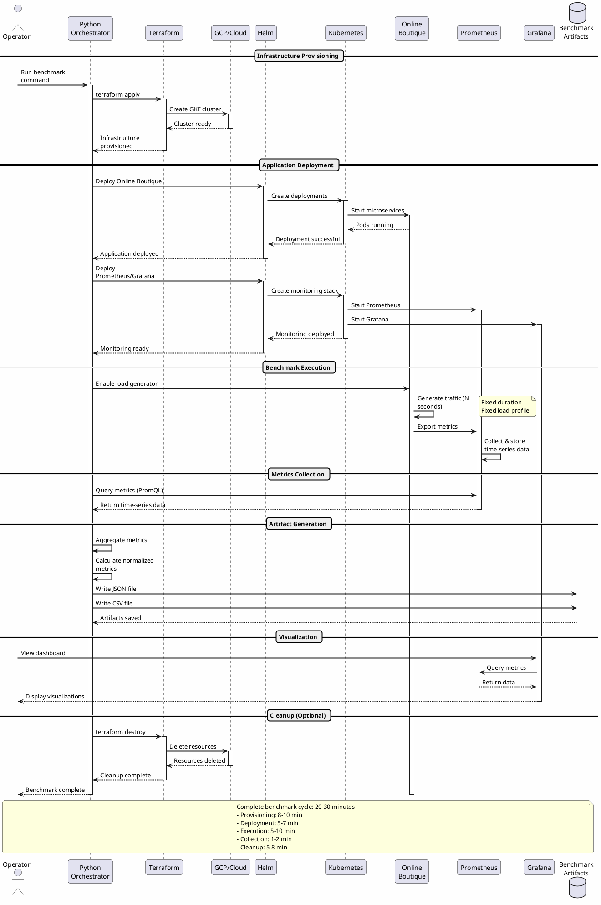
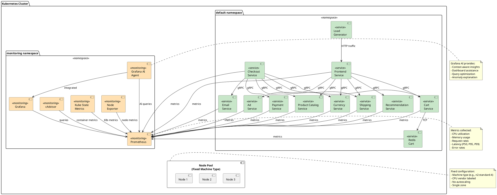

# System Architecture Diagram

## Overall System Architecture

```
┌─────────────────────────────────────────────────────────────────────────────┐
│                         BENCHMARK ORCHESTRATION LAYER                        │
│                                                                              │
│  ┌────────────────────────────────────────────────────────────────────┐    │
│  │                      Python Orchestrator (main.py)                  │    │
│  │                                                                     │    │
│  │  ┌──────────────┐  ┌──────────────┐  ┌────────────────┐          │    │
│  │  │  Terraform   │  │     Helm     │  │   Prometheus   │          │    │
│  │  │   Executor   │  │   Deployer   │  │     Client     │          │    │
│  │  └──────────────┘  └──────────────┘  └────────────────┘          │    │
│  │                                                                     │    │
│  │  ┌──────────────┐  ┌──────────────────────────────────┐          │    │
│  │  │  Benchmark   │  │      Artifact Generator          │          │    │
│  │  │   Runner     │  │   (JSON/CSV output)              │          │    │
│  │  └──────────────┘  └──────────────────────────────────┘          │    │
│  └────────────────────────────────────────────────────────────────────┘    │
│                                                                              │
└───────────────┬────────────────────────────────────────────┬────────────────┘
                │                                            │
                ▼                                            ▼
┌───────────────────────────────────┐    ┌──────────────────────────────────┐
│    INFRASTRUCTURE LAYER           │    │     BENCHMARK ARTIFACTS          │
│                                   │    │                                  │
│  ┌─────────────────────────────┐ │    │  ┌────────────────────────────┐ │
│  │   Terraform (IaC)           │ │    │  │  benchmarks/*.json         │ │
│  │                             │ │    │  │  - Machine metadata        │ │
│  │  ┌──────┐  ┌──────┐        │ │    │  │  - Performance metrics     │ │
│  │  │ GCP  │  │ AWS  │ ...    │ │    │  │  - Normalized results      │ │
│  │  └──────┘  └──────┘        │ │    │  └────────────────────────────┘ │
│  │                             │ │    │                                  │
│  │  Creates:                   │ │    │  ┌────────────────────────────┐ │
│  │  - Kubernetes clusters      │ │    │  │  benchmarks/*.csv          │ │
│  │  - Fixed node pools         │ │    │  │  - Comparison-ready format │ │
│  │  - Node labels (CPU info)   │ │    │  └────────────────────────────┘ │
│  └─────────────────────────────┘ │    │                                  │
└───────────────┬───────────────────┘    └──────────────────────────────────┘
                │
                ▼
┌────────────────────────────────────────────────────────────────────────────┐
│                        KUBERNETES CLUSTER LAYER                             │
│                                                                             │
│  ┌─────────────────────────────────────────────────────────────────────┐  │
│  │                        Application Workloads                         │  │
│  │                                                                      │  │
│  │  ┌──────────────────────────────────────────────────────────────┐  │  │
│  │  │              Online Boutique (Helm Chart)                     │  │  │
│  │  │                                                               │  │  │
│  │  │  ┌──────────┐  ┌──────────┐  ┌──────────┐  ┌────────────┐  │  │  │
│  │  │  │ Frontend │  │   Cart   │  │ Checkout │  │  Payment   │  │  │  │
│  │  │  └──────────┘  └──────────┘  └──────────┘  └────────────┘  │  │  │
│  │  │                                                               │  │  │
│  │  │  ┌──────────┐  ┌──────────┐  ┌──────────┐  ┌────────────┐  │  │  │
│  │  │  │Recommend │  │  Product │  │ Currency │  │  Shipping  │  │  │  │
│  │  │  └──────────┘  └──────────┘  └──────────┘  └────────────┘  │  │  │
│  │  │                                                               │  │  │
│  │  │  ┌──────────┐  ┌──────────┐  ┌──────────────────────────┐  │  │  │
│  │  │  │  Email   │  │    Ad    │  │   Load Generator         │  │  │  │
│  │  │  └──────────┘  └──────────┘  └──────────────────────────┘  │  │  │
│  │  │                                                               │  │  │
│  │  │  Resource Limits: Fixed for reproducibility                  │  │  │
│  │  │  Node Affinity: workload=benchmark                           │  │  │
│  │  └──────────────────────────────────────────────────────────────┘  │  │
│  └─────────────────────────────────────────────────────────────────────┘  │
│                                                                             │
│  ┌─────────────────────────────────────────────────────────────────────┐  │
│  │                     Monitoring & Observability                       │  │
│  │                                                                      │  │
│  │  ┌──────────────────────────────────────────────────────────────┐  │  │
│  │  │              kube-prometheus-stack (Helm Chart)              │  │  │
│  │  │                                                               │  │  │
│  │  │  ┌────────────────┐            ┌─────────────────┐          │  │  │
│  │  │  │  Prometheus    │            │    Grafana      │          │  │  │
│  │  │  │                │            │                 │          │  │  │
│  │  │  │  - Scrapes     │◄───────────┤  - Dashboards   │          │  │  │
│  │  │  │    metrics     │            │  - Alerts       │          │  │  │
│  │  │  │  - Stores      │            │  - Queries      │          │  │  │
│  │  │  │    time-series │            │                 │          │  │  │
│  │  │  │  - PromQL API  │            │  LoadBalancer   │          │  │  │
│  │  │  │                │            │  (External IP)  │          │  │  │
│  │  │  └────────────────┘            └─────────────────┘          │  │  │
│  │  │                                                               │  │  │
│  │  │  ┌────────────────┐  ┌──────────────┐  ┌─────────────────┐ │  │  │
│  │  │  │ Node Exporter  │  │ Kube-State   │  │   cAdvisor      │ │  │  │
│  │  │  │ (Node metrics) │  │   Metrics    │  │ (Container)     │ │  │  │
│  │  │  └────────────────┘  └──────────────┘  └─────────────────┘ │  │  │
│  │  └──────────────────────────────────────────────────────────────┘  │  │
│  └─────────────────────────────────────────────────────────────────────┘  │
│                                                                             │
└─────────────────────────────────────────────────────────────────────────────┘
                                    │
                                    │ Metrics Flow
                                    ▼
┌────────────────────────────────────────────────────────────────────────────┐
│                          AI AGENT LAYER (Future)                            │
│                                                                             │
│  ┌─────────────────────────────────────────────────────────────────────┐  │
│  │                        AI Agent Service                              │  │
│  │                                                                      │  │
│  │  ┌──────────────┐  ┌──────────────┐  ┌──────────────────────────┐ │  │
│  │  │  Prometheus  │  │  Kubernetes  │  │   Benchmark Archive      │ │  │
│  │  │     Tool     │  │     Tool     │  │        Tool              │ │  │
│  │  └──────────────┘  └──────────────┘  └──────────────────────────┘ │  │
│  │         ▲                  ▲                      ▲                  │  │
│  │         └──────────────────┴──────────────────────┘                  │  │
│  │                            │                                          │  │
│  │                    ┌───────┴────────┐                                │  │
│  │                    │  LLM (GPT-4)   │                                │  │
│  │                    │   Orchestrator │                                │  │
│  │                    └───────┬────────┘                                │  │
│  │                            │                                          │  │
│  │         ┌──────────────────┼──────────────────┐                      │  │
│  │         ▼                  ▼                  ▼                      │  │
│  │    ┌────────┐         ┌────────┐        ┌─────────┐                │  │
│  │    │  CLI   │         │  API   │        │ Web UI  │                │  │
│  │    └────────┘         └────────┘        └─────────┘                │  │
│  │                                                                      │  │
│  │  Capabilities:                                                       │  │
│  │  - Metrics Analysis & Anomaly Detection                             │  │
│  │  - Deployment Status & Troubleshooting                              │  │
│  │  - Optimization Recommendations                                     │  │
│  └─────────────────────────────────────────────────────────────────────┘  │
└────────────────────────────────────────────────────────────────────────────┘
```

## Component Details

### 1. Orchestration Layer
- **Python Scripts**: Main automation logic
- **Modules**: Specialized components for each task
- **Configuration**: Parameterized for different scenarios

### 2. Infrastructure Layer
- **Terraform**: Cloud-agnostic IaC
- **Multi-cloud Support**: GCP (implemented), AWS/Azure (planned)
- **Fixed Configuration**: Ensures reproducible benchmarks

### 3. Kubernetes Cluster
- **Online Boutique**: Production-like microservices workload
- **Monitoring Stack**: Prometheus + Grafana for metrics
- **Fixed Resources**: Consistent resource allocation

### 4. Metrics & Storage
- **Time-series Metrics**: Collected by Prometheus
- **Benchmark Artifacts**: JSON/CSV files for comparison
- **Historical Data**: Enables trend analysis

### 5. AI Agent (Design)
- **Read-only Access**: Safe operational intelligence
- **Multiple Interfaces**: CLI, API, Web UI
- **LLM-powered**: Natural language queries and insights

## PlantUML Architecture Diagrams

### System Component Diagram

The following PlantUML diagram provides a visual representation of the system architecture with clear component relationships:

```plantuml
@startuml Benchmark Pipeline Architecture

!define RECTANGLE class

skinparam componentStyle rectangle
skinparam backgroundColor #FEFEFE
skinparam component {
    BackgroundColor<<orchestration>> #E1F5FF
    BackgroundColor<<infrastructure>> #FFF3E0
    BackgroundColor<<application>> #E8F5E9
    BackgroundColor<<monitoring>> #FCE4EC
    BackgroundColor<<ai>> #F3E5F5
    BorderColor #333333
    FontSize 12
}

package "Orchestration Layer" <<orchestration>> {
    [Python Orchestrator] as Orchestrator
    [Terraform Executor] as TerraformExec
    [Helm Deployer] as HelmDeploy
    [Prometheus Client] as PrometheusClient
    [Benchmark Runner] as BenchmarkRunner
    [Artifact Generator] as ArtifactGen
}

package "Infrastructure Layer" <<infrastructure>> {
    [Terraform IaC] as Terraform
    cloud "Cloud Provider" {
        [GCP/GKE] as GCP
        [AWS/EKS] as AWS
        [Azure/AKS] as Azure
    }
}

package "Kubernetes Cluster" <<application>> {
    package "Application Namespace" {
        [Online Boutique\nMicroservices] as OnlineBoutique
        [Load Generator] as LoadGen
    }
    
    package "Monitoring Namespace" {
        [Prometheus] as Prometheus
        [Grafana] as Grafana
        [Node Exporter] as NodeExporter
        [cAdvisor] as cAdvisor
    }
}

package "Data Storage" {
    database "Benchmark\nArtifacts" as Artifacts {
        file "JSON Files" as JSON
        file "CSV Files" as CSV
    }
}

package "AI Agent Layer (Future)" <<ai>> {
    [AI Agent Service] as AIAgent
    [LLM (GPT-4)] as LLM
    [Grafana AI] as GrafanaAI
}

' Orchestrator connections
Orchestrator --> TerraformExec : controls
Orchestrator --> HelmDeploy : controls
Orchestrator --> BenchmarkRunner : controls
Orchestrator --> PrometheusClient : queries
Orchestrator --> ArtifactGen : generates

' Infrastructure provisioning
TerraformExec --> Terraform : executes
Terraform --> GCP : provisions
Terraform --> AWS : provisions (future)
Terraform --> Azure : provisions (future)

' Application deployment
HelmDeploy --> OnlineBoutique : deploys
HelmDeploy --> Prometheus : deploys
HelmDeploy --> Grafana : deploys

' Monitoring flow
OnlineBoutique --> Prometheus : exposes metrics
LoadGen --> OnlineBoutique : generates traffic
NodeExporter --> Prometheus : node metrics
cAdvisor --> Prometheus : container metrics
Grafana --> Prometheus : queries

' Data collection
PrometheusClient --> Prometheus : queries (PromQL)
ArtifactGen --> JSON : creates
ArtifactGen --> CSV : creates

' AI Agent integration
AIAgent --> Prometheus : queries metrics
AIAgent --> JSON : reads history
AIAgent --> LLM : uses
GrafanaAI --> Grafana : integrated
GrafanaAI --> Prometheus : queries

note right of Orchestrator
  Single entry point for
  all benchmark operations
end note

note right of Terraform
  Cloud-agnostic infrastructure
  Fixed configurations for
  reproducible benchmarks
end note

note right of Prometheus
  Collects time-series metrics:
  - CPU utilization
  - Memory usage
  - Request rates
  - Latency
end note

note right of AIAgent
  Provides operational intelligence:
  - Metrics analysis
  - Anomaly detection
  - Recommendations
end note

@enduml
```



### Data Flow Sequence Diagram

This PlantUML sequence diagram illustrates the complete benchmark execution workflow:



### Deployment Architecture Diagram

This diagram shows the Kubernetes cluster internal structure:



### How to Use PlantUML Diagrams

To render these diagrams:

1. **Online**: Visit [PlantUML Online Editor](http://www.plantuml.com/plantuml/uml/)
2. **VS Code**: Install "PlantUML" extension
3. **Command Line**: Install PlantUML and run:
   ```bash
   plantuml diagram.puml
   ```
4. **Documentation**: Many documentation platforms (Confluence, GitHub with plugins) support PlantUML rendering

These diagrams can be embedded in documentation, presentations, or exported as PNG/SVG for reports.

## Data Flow

```
1. User initiates benchmark
   └─> Python Orchestrator

2. Provision infrastructure
   └─> Terraform creates K8s cluster with fixed config

3. Deploy applications
   ├─> Helm deploys Online Boutique
   └─> Helm deploys Prometheus/Grafana

4. Execute benchmark
   └─> Load generator creates traffic for N seconds

5. Collect metrics
   └─> Python queries Prometheus API (PromQL)

6. Generate artifacts
   ├─> JSON file with complete results
   └─> CSV file for easy comparison

7. Analyze (Future)
   └─> AI Agent provides insights
```

## Key Design Principles

1. **Reproducibility**: Fixed configurations ensure comparable results
2. **Cloud-agnostic**: Kubernetes abstraction enables portability
3. **Automation-first**: Minimal manual intervention
4. **Separation of concerns**: Distinct tools for distinct tasks
5. **Observability**: Comprehensive metrics collection
6. **Extensibility**: Modular design supports future enhancements

## Network Topology

```
┌──────────────────────────────────────────────────────────────┐
│                    Cloud Provider Network                     │
│                                                               │
│  ┌────────────────────────────────────────────────────────┐  │
│  │              Kubernetes Cluster (VPC)                   │  │
│  │                                                          │  │
│  │  ┌─────────────────┐      ┌─────────────────────────┐  │  │
│  │  │  Namespace:     │      │  Namespace: monitoring  │  │  │
│  │  │  default        │      │                         │  │  │
│  │  │                 │      │  ┌──────────────────┐   │  │  │
│  │  │  ┌───────────┐  │      │  │   Prometheus     │   │  │  │
│  │  │  │  Online   │  │      │  │   (ClusterIP)    │   │  │  │
│  │  │  │ Boutique  │  │      │  └────────┬─────────┘   │  │  │
│  │  │  │ Services  │──scrape─────────────┘             │  │  │
│  │  │  └───────────┘  │      │                         │  │  │
│  │  │        │        │      │  ┌──────────────────┐   │  │  │
│  │  │  ┌─────▼─────┐ │      │  │    Grafana       │   │  │  │
│  │  │  │LoadBalancer│◄─────query──│ (LoadBalancer) │   │  │  │
│  │  │  │(External) │ │      │  └──────────────────┘   │  │  │
│  │  │  └───────────┘ │      └─────────────────────────┘  │  │
│  │  └─────────────────┘                                   │  │
│  │                                                         │  │
│  └────────────────────────────────────────────────────────┘  │
│                                                               │
└────────────────────────┬──────────────────────────────────────┘
                         │
                         │ External Access
                         │
                 ┌───────┴────────┐
                 │   Operator     │
                 │  (kubectl)     │
                 └────────────────┘
```

## Security Layers

1. **Network**: VPC isolation, network policies
2. **Access**: RBAC, service accounts
3. **Credentials**: Secrets management, encrypted at rest
4. **Audit**: Logging of all operations
5. **Agent**: Read-only permissions, no cluster modifications

## File Structure

```
DevOpsAIUseCase/
├── terraform/              # Infrastructure as Code
│   ├── gcp/               # GCP configuration (implemented)
│   ├── aws/               # AWS configuration (template)
│   └── azure/             # Azure configuration (template)
├── kubernetes/            # K8s manifests and Helm values
│   ├── online-boutique/   # Application deployment
│   └── monitoring/        # Prometheus + Grafana
├── automation/            # Python orchestration
│   ├── main.py           # Entry point
│   ├── modules/          # Automation modules
│   └── requirements.txt  # Dependencies
├── benchmarks/           # Output artifacts (JSON/CSV)
├── docs/                 # Documentation
│   ├── diagrams/         # Architecture diagrams
│   └── AI_AGENT_ARCHITECTURE.md
└── README.md            # Project overview
```
